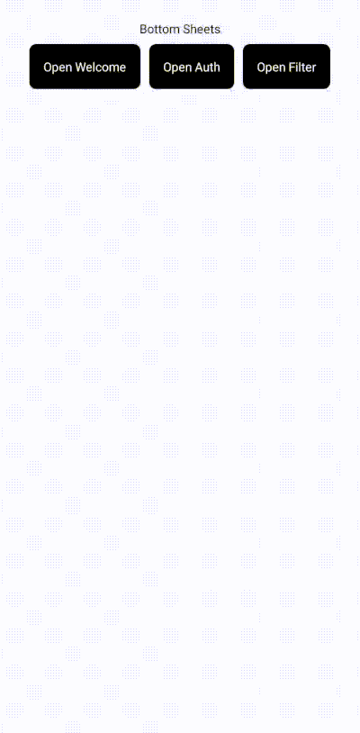

# react-native-bottom-sheets

A lightweight, developer-friendly wrapper around [@gorhom/bottom-sheet](https://github.com/gorhom/react-native-bottom-sheet) that simplifies the integration of bottom sheets in React Native projects.

{width=300}

## Features

- **No context providers needed**: Use bottom sheets anywhere in your app without wrapping your code in context providers
- Easy-to-use API for managing multiple bottom sheets across your app
- Simplified state management for bottom sheets
- Seamless integration with [@gorhom/bottom-sheet](https://github.com/gorhom/react-native-bottom-sheet)
- TypeScript support
- Event-based communication for opening and closing bottom sheets

## Installation

```bash
npm install react-native-bottom-sheets @gorhom/bottom-sheet
```

or

```bash
yarn add react-native-bottom-sheets @gorhom/bottom-sheet
```

## Usage

1. Add the `BottomSheets` component to your app's root component:

```jsx
import { GestureHandlerRootView } from "react-native-gesture-handler";
import { BottomSheets } from "react-native-bottom-sheets";
import YourBottomSheets from "./YourBottomSheets";

const bottomSheets = {
  FilterBottomSheet,
  WelcomeBottomSheet,
  AuthBottomSheet,
  // add your bottom sheets here
};

export default function App() {
  return (
    <GestureHandlerRootView>
      <YourApp />
      <BottomSheets sheets={bottomSheets} />
    </GestureHandlerRootView>
  );
}
```

**Note**: No need to wrap your app with any additional context providers!

2. Create your bottom sheet components:

```jsx
import { StyleSheet, View, Text } from "react-native";
import { BottomSheetProps, BottomSheet } from "react-native-bottom-sheets";

const AuthBottomSheet = ({ defaultProps, params }: BottomSheetProps) => {
  return (
    <BottomSheet snapPoints={["30%"]} {...defaultProps}>
      <View style={styles.container}>
        <Text>Auth Bottom Sheet</Text>
        <Text>{JSON.stringify(params, null, 2)}</Text>
      </View>
    </BottomSheet>
  );
};

const styles = StyleSheet.create({
  container: {
    flex: 1,
    justifyContent: "center",
    alignItems: "center",
  },
});

export default AuthBottomSheet;
```

3. Use the `useBottomSheets` hook to manage bottom sheets from anywhere in your app:

```jsx
import { useBottomSheets } from "react-native-bottom-sheets";

const YourComponent = () => {
  const { openBottomSheet, closeBottomSheet } = useBottomSheets();

  const handleOpenBottomSheet = () => {
    openBottomSheet("AuthBottomSheet", { someParam: "value" }, () => {
      console.log("Bottom sheet opened");
    });
  };

  return <Button title="Open Auth Sheet" onPress={handleOpenBottomSheet} />;
};
```

## Why use react-native-bottom-sheets?

1. **No Context Providers**: Unlike many state management solutions, this doesn't require you to wrap your app in context providers. This means less boilerplate and easier integration.

2. **Simplified API**: Manage your bottom sheets with a clean, intuitive API.

3. **Global State Management**: Control your bottom sheets from anywhere in your app without prop drilling or complex state management.

4. **TypeScript Support**: Enjoy full TypeScript support for a better development experience.

5. **Flexible and Powerful**: While simplifying the API, we maintain full access to @gorhom/bottom-sheet's props and features.

## API

### `useBottomSheets` Hook

- `openBottomSheet(name: string, params?: any, callback?: () => void)`: Opens a bottom sheet
- `closeBottomSheet(callback?: () => void)`: Closes the currently open bottom sheet

### `BottomSheet` Component

Wrapper for the `@gorhom/bottom-sheet` component

- ...all props from `@gorhom/bottom-sheet`

### `BottomSheets` Component

- `sheets: Record<string, React.ComponentType<any>>`: Object containing all your bottom sheet components

## Contributing

Contributions are welcome! Please feel free to submit a Pull Request.

## License

This project is licensed under the MIT License.
